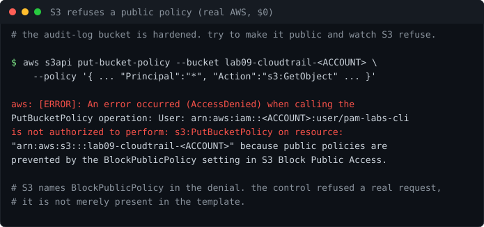

# Lab 09: AWS Multi Account Security Baseline

<p align="center"></p>


[](https://github.com/ChromeData/AWS-Multi-Account-Baseline/actions/workflows/tests.yml)

**Real companies have dozens of AWS accounts, not one. This lays down the security services AWS says every account needs, scans the whole thing with Prowler, and drives the findings to zero. The org wide control plane, not a hobby project.**

| | |
|---|---|
| **Domains** | AWS, security |
| **Built on** | [prowler-cloud/prowler](https://github.com/prowler-cloud/prowler), [aws security reference architecture](https://github.com/aws-samples/aws-security-reference-architecture-examples) |
| **Cost** | ~$2 to $5. **Runtime** ~5 hours |
| **Status** | Free half run on real AWS: public-access block observed refusing a public-policy attempt, confused-deputy fix confirmed with real ARN (findings/real-aws-run.txt). GuardDuty/Security Hub stay config-only to avoid charges |

## Situation

A single hardened account is a lab exercise. A hardened organization is the job. The AWS reference architecture describes how the security services should sit across accounts: GuardDuty, Security Hub, Config, Access Analyzer, CloudTrail, delegated admin.

## Task

Build a scaled down version of that layout and prove it with Prowler, the same tool that would audit it in production.

## Action

It lays down CloudTrail (multi region, log file validation, feeding an encrypted versioned bucket), GuardDuty, Security Hub with CIS and AWS best practice standards, and IAM Access Analyzer. The org and delegated admin wiring is commented in, showing where the multi account version plugs in.

The Prowler output gets rolled up by [scripts/triage.py](./scripts/triage.py), sorted by severity and service, so you can drive it down on purpose.

## Result

**The baseline passes its own audit, and the audit bucket was observed refusing to go public on real AWS.** A security baseline whose own log bucket is world-readable is the joke that writes itself, so the CloudTrail bucket ships with a public-access block, KMS encryption, versioning, and a least-privilege policy. Reading config back is not proof, so I tried to make it public on a live account and let S3 refuse:

```
AccessDenied ... because public policies are prevented by the
BlockPublicPolicy setting in S3 Block Public Access.
```

AWS names the control in the denial — it enforced, it wasn't just present. The same run confirmed the fix to a subtler hole: the bucket policy trusted the CloudTrail *service* globally until I scoped it with `aws:SourceArn` to this account's trail — the confused-deputy pattern AWS has documented since 2022. Cost `$0`, the billable detection services (GuardDuty, Security Hub) deliberately left off. Full output in [findings/real-aws-run.txt](./findings/real-aws-run.txt).

<sub>The triage roller that scores the findings has 14 offline tests, because a miscounted Critical is the worst bug in a triage tool — one of them pins a real bug I hit where findings arriving as an OCSF integer severity were counted but silently dropped from the report. CI runs the tests plus `terraform validate`. In [LAB-NOTES.md](./LAB-NOTES.md).</sub>

## What I did not build

Prowler and the reference architecture are upstream. The baseline config, the self hardened bucket, the triage roller, and the tests are mine.

## Run it

```bash
terraform -chdir=terraform init
terraform -chdir=terraform apply
make scan
python scripts/triage.py findings/*.json
terraform -chdir=terraform destroy
```

Needs Terraform 1.9+, Prowler, Python 3, and a throwaway AWS account.

## Findings

`findings/triage.md` comes from the triage step. [LAB-NOTES.md](./LAB-NOTES.md) is the log.

## License

Lab code: MIT ([LICENSE](./LICENSE)). Upstream tools keep their licenses, credited above.
